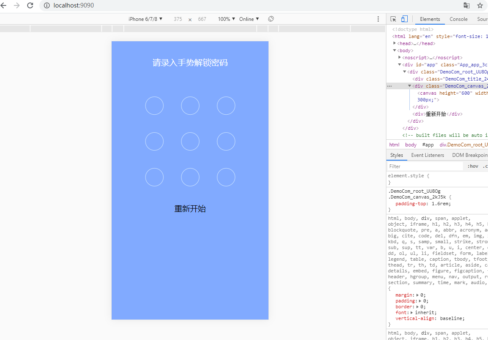

# vue-lock

## 引入

```
  npm  i  vue-lock
```

## props 说明

```
  props: {
    width: { //canvas的宽度
      type: Number,
      default: 300
    },
    height: { //canvas的高度
      type: Number,
      default: 300
    },
    chooseType: { //生成点的个数 3*3 4*4
      type: Number,
      default: 3
    },
    disbaled: {
      type: Boolean, // 禁止事件响应
      default: false
    },
    strokeStyle: { // 画笔的颜色
      type: String,
      default: '#CFE6FF'
    },
    fillStyle: { // 填充点的颜色，主要是手势解锁的点
      type: String,
      default: '#CFE6FF'
    },
    pathLineWidth: { // 轨迹线的粗细
      type: Number,
      default: 3
    },
    pathCircleWidth: { // 生成点的粗细
      type: Number,
      default: 2
    }
  }
```

### event

```
@drawEnd 画结束后的回调
```

### 提供服务

drawStatusPoint(color) // 填充点的颜色，通过 ref 调用

### 使用

```
// 引入

import { CanvasLock } from 'vue-lock';

// 注册
 components: {
    CanvasLock,
  },

// 使用

 <canvas-lock ref="canvas" @drawEnd="drawEnd" :disbaled="disbaledDraw"></canvas-lock>


```

### 示例


<br>


```
  $ cd test
  $ npm install
  $ npm run  serve
```
